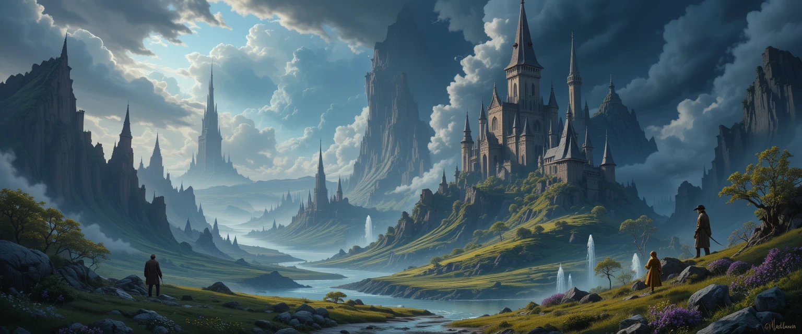
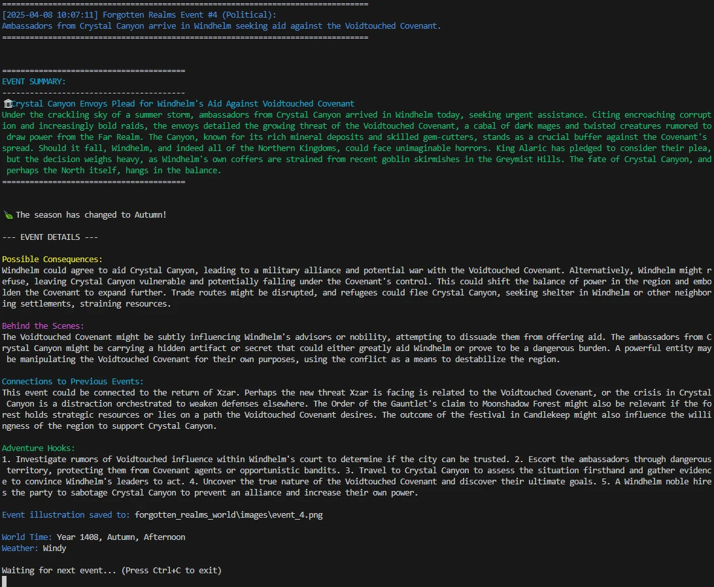
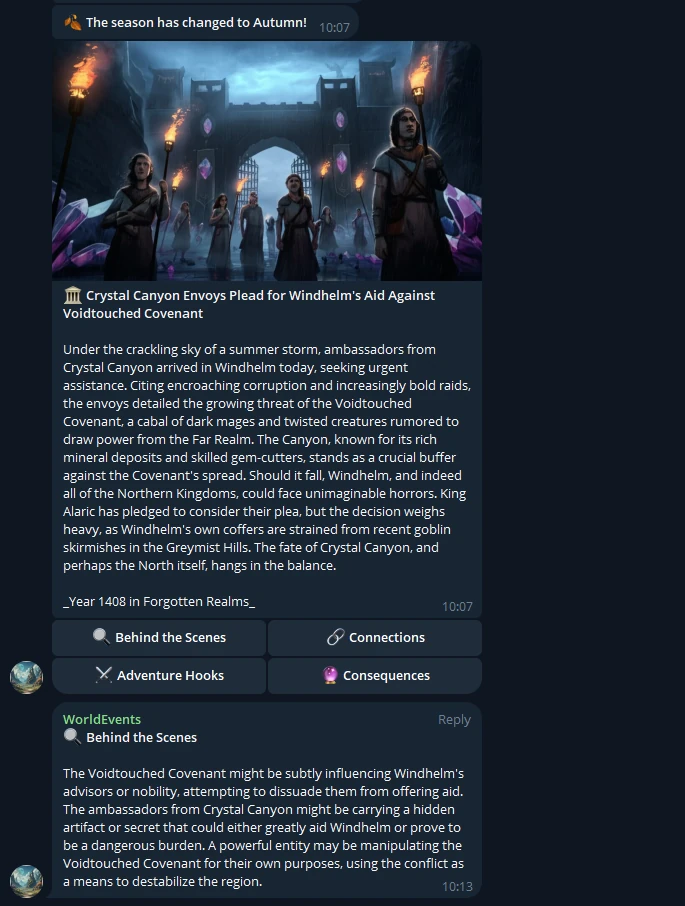

[](https://github.com/armysarge/Telegram-Subscription-Bot)

[](https://www.buymeacoffee.com/armysarge)

[](https://www.sqlite.org/index.html)
[](https://www.python.org/)
[](https://developers.google.com/gemini)
[](https://core.telegram.org/bots/api)

[](https://opensource.org/licenses/MIT)
[](https://github.com/armysarge/FantasyWorld/issues)


# Fantasy World Event Generator

An AI-powered fantasy world event generator that creates dynamic, evolving stories using Google's Gemini AI and optional Telegram integration.




## Features

- **Procedural Fantasy Events**: Generate events in diverse categories like political, magical, social, economic, conflict, mystery, and more
- **Dynamic World State**: World state evolves with each event, including seasons, weather, character relationships, and faction dynamics
- **AI-Enhanced Storytelling**: Integration with Google's Gemini AI to add rich details, consequences,  plot hooks, connections between events
- **Event Images**: Generate fantasy illustrations for events (requires Google Gemini API key)
- **Telegram Integration**: Broadcast events (with images) to Telegram chats with special admin-only details
- **Persistent Worlds**: Save and reload your fantasy worlds with persistent state
- **SQLite Database**: All world data, events, and relationships are stored in SQLite databases, making it easy to access and reuse the data in other projects

## Data Persistence

The Fantasy World Generator uses SQLite to store all world information, including:

- Generated events with full details and relationships
- Character information and their evolving relationships
- Faction dynamics and territorial changes
- Historical event chains and consequences
- World state including weather, seasons, and political climate

This database approach allows you to:
- Access your fantasy world data from external applications
- Create custom analytics or visualization tools
- Develop complementary applications that build on your world's history
- Export data for use in other game systems or storytelling platforms

## Telegram Integration

The Fantasy World Generator includes full Telegram bot integration that allows you to:

- Receive event notifications directly to your Telegram account
- View images associated with events
- Access hidden GM/DM information through interactive buttons
- Explore connections to previous events
- Discover adventure hooks and possible consequences

### Telegram Button Functionality

Each event sent to Telegram includes interactive buttons that provide additional GM/DM information:

- 🔍 **Behind the Scenes**: Hidden details about the event
- 🔗 **Connections**: How this event relates to previous events
- ⚔️ **Adventure Hooks**: Potential adventure hooks related to this event
- 🔮 **Consequences**: Possible outcomes of this event

Each event maintains its own private data, ensuring that buttons from previous events will always display the correct information associated with that specific event.

## Requirements

- Python 3.8+
- Required packages: see `requirements.txt`
- Optional: Google Gemini API key for AI-enhanced features
- Optional: Telegram Bot Token for messaging integration

## Installation

1. Clone this repository:
   ```
   git clone https://github.com/armysarge/FantasyWorld.git
   cd FantasyWorld
   ```

2. Install dependencies:
   ```
   pip install -r requirements.txt
   ```

3. Run the generator:
   ```
   python Fantasy.py
   ```

## Usage

When you start the program, you'll be prompted to:

1. Enter your fantasy world name
2. Optionally provide a Google Gemini API key for AI-enhanced features
3. Optionally provide a Telegram Bot Token and Chat Id for sending events to Telegram

Events will automatically be generated at random intervals (10-120 minutes by default), and you'll see them appear in the console with detailed information and story elements.

## Customization

You can customize the generator by:

1. Editing `fantasy_events_data.py` to modify the event templates, characters, locations, etc.
2. Adjusting the event frequency in `Fantasy.py`
3. Adding your own event categories and templates

## Project Structure

- `Fantasy.py` - Main script and event generation engine
- `ai_functions.py` - AI integration using Google's Gemini API
- `telegram_functions.py` - Telegram integration for broadcasting events
- `fantasy_events_data.py` - Event templates and world data
- `requirements.txt` - Required Python dependencies

## Console Example


## Telegram Example


## Contributing

Contributions are welcome! Please feel free to submit a Pull Request.

## License

This project is licensed under the MIT License - see the LICENSE file for details.

## Acknowledgments

- Google Gemini API for providing the AI capabilities
- Telegram Bot API for messaging features