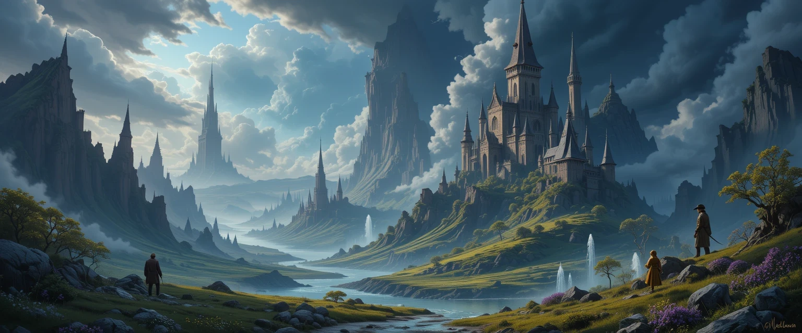
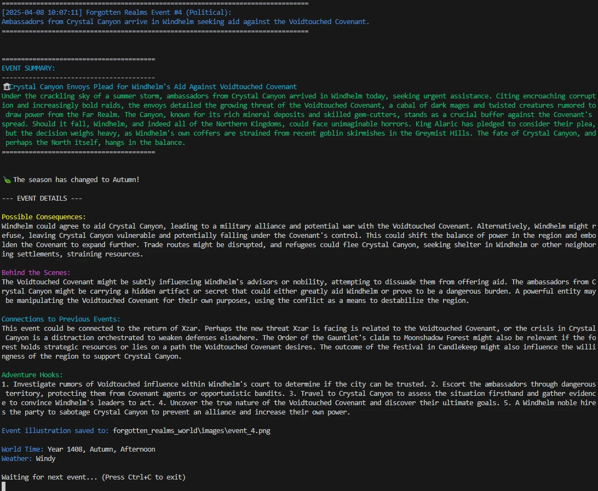
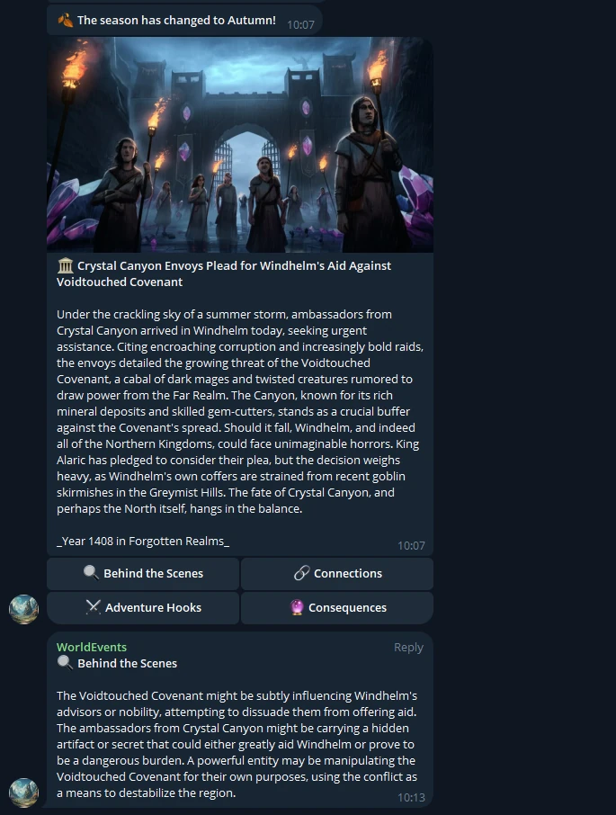

[](https://github.com/armysarge/FantasyWorld)

[](https://www.buymeacoffee.com/armysarge)

[](https://www.sqlite.org/index.html)
[](https://www.python.org/)
[](https://developers.google.com/gemini)
[](https://platform.openai.com/)
[](https://github.com/features/copilot)
[](https://core.telegram.org/bots/api)

[](https://opensource.org/licenses/MIT)
[](https://github.com/armysarge/FantasyWorld/issues)


# Fantasy World Event Generator

An AI-powered fantasy world event generator that creates dynamic, evolving stories with **multi-AI provider support** (Google Gemini, OpenAI, GitHub Copilot, or any OpenAI-compatible endpoint) and optional Telegram integration.




## Features

- **Multi-AI Provider Support**: Choose between Google Gemini, OpenAI, GitHub Copilot, or any custom OpenAI-compatible API — switch providers and models at any time
- **Three Event Modes**:
  - **Template** — Classic procedural generation from an extensive template library
  - **Hybrid** — 40% fully AI-generated events, 60% AI-enhanced templates for the best of both worlds
  - **Full AI** — 100% AI-generated events with complete creative freedom
- **Procedural Fantasy Events**: Generate events across 12+ categories including political, magical, social, economic, conflict, mystery, natural disasters, and more
- **Dynamic World State**: World state evolves with each event — seasons cycle, weather shifts, character relationships develop, and faction dynamics change
- **AI-Enhanced Storytelling**: Rich details, consequences, plot hooks, and connections between events
- **Event Images**: Generate fantasy illustrations for events (Gemini provider)
- **Telegram Integration**: Broadcast events (with images) to Telegram chats with interactive admin-only detail buttons
- **Interactive Wait Menu**: During the countdown between events, press `M` to open a menu to change AI provider, model, event mode, wait interval, or view world details without restarting
- **Persistent Worlds**: Save and reload your fantasy worlds with full state persistence
- **Persistent Settings**: API keys, provider, model, event mode, and Telegram config are saved between sessions
- **Extensive Template Library**: 500+ templates across weather, disasters, mysteries, politics, economics, social events, magic, character development, and more — all in a separate data file for easy customization
- **Fantasy Newspaper Web Page**: A built-in Flask web server serves a tabloid-style newspaper page at `http://localhost:5000` — shows the latest event as a headline and article with images, plus a sidebar of recent headlines
- **SQLite Database**: All world data, events, relationships, characters, and locations are stored in dedicated SQLite tables for easy access and reuse

## AI Providers

| Provider | Text Generation | Image Generation | Models |
|----------|:-:|:-:|--------|
| **Google Gemini** | ✅ | ✅ | gemini-2.0-flash, gemini-2.5-flash-preview-04-17, etc. |
| **OpenAI** | ✅ | ❌ | gpt-4o, gpt-4o-mini, gpt-4-turbo, etc. |
| **GitHub Copilot** | ✅ | ❌ | gpt-4o, gpt-4o-mini, o3-mini, etc. |
| **Custom (OpenAI-compatible)** | ✅ | ❌ | Any model at your endpoint |

> **Note:** Image generation is currently only supported with the Google Gemini provider. Other providers will gracefully skip image generation.

## Data Persistence

The Fantasy World Generator uses SQLite to store all world information across **dedicated tables**:

| Table | Contents |
|-------|----------|
| `events` | Every generated event — timestamp, category, text, location, characters, factions, image path |
| `event_details` | Per-event Telegram button data — consequences, hidden details, connections, adventure hooks |
| `characters` | One row per unique character — type, last known location, last seen timestamp, total event count |
| `locations` | One row per unique location — last event ID, last activity timestamp, event count, characters present |
| `world_state` | Full world-state snapshots saved after every event (JSON) |

This structure allows you to:
- Access your fantasy world data from external applications
- Create custom analytics or visualisation tools
- Develop complementary applications that build on your world's history
- Export data for use in other game systems or storytelling platforms

## Telegram Integration

The Fantasy World Generator includes full Telegram bot integration that allows you to:

- Receive event notifications directly to your Telegram account
- View images associated with events
- Access hidden GM/DM information through interactive buttons
- Explore connections to previous events
- Discover adventure hooks and possible consequences

### Telegram Button Functionality

Each event sent to Telegram includes interactive buttons that provide additional GM/DM information:

- 🔍 **Behind the Scenes**: Hidden details about the event
- 🔗 **Connections**: How this event relates to previous events
- ⚔️ **Adventure Hooks**: Potential adventure hooks related to this event
- 🔮 **Consequences**: Possible outcomes of this event

Each event maintains its own private data, ensuring that buttons from previous events will always display the correct information associated with that specific event.

## Requirements

- Python 3.8+
- Required packages: see `requirements.txt`
- At least one AI provider API key:
  - Google Gemini API key (recommended — supports both text and image generation)
  - OpenAI API key
  - GitHub Copilot API key
  - Or a custom OpenAI-compatible endpoint + key
- Optional: Telegram Bot Token for messaging integration

## Installation

1. Clone this repository:
   ```
   git clone https://github.com/armysarge/FantasyWorld.git
   cd FantasyWorld
   ```

2. Install dependencies:
   ```
   pip install -r requirements.txt
   ```

3. Run the generator:
   ```
   python Fantasy.py
   ```

## Usage

When you start the program for the **first time**, you'll be prompted to:

1. Enter your fantasy world name
2. Select your AI provider (Gemini, OpenAI, GitHub Copilot, or Custom)
3. Enter your API key for the chosen provider
4. Optionally specify a model (or use the provider's default)
5. Choose an event mode (Template, Hybrid, or Full AI)
6. Optionally provide a Telegram Bot Token and Chat ID for sending events to Telegram

All settings are saved automatically to `fantasy_world_settings.json` (next to the script) and reused on every subsequent run — the world and its database are always found regardless of where you launch the script from.

Events are generated at random intervals (10–120 minutes by default).

### Interactive Menu

During the countdown between events, press **`M`** to open the interactive menu:

| Key | Action |
|-----|--------|
| `1` | Trigger the next event immediately |
| `2` | Change AI provider (re-initialises AI with new credentials) |
| `3` | Change AI model |
| `4` | Change event mode (template / hybrid / full_ai) |
| `5` | Change min/max wait interval |
| `6` | View world summary |
| `7` | View active plots |
| `8` | View character details |
| `9` | View location details |
| `N` | Open the newspaper page in your browser |
| `0` | Exit |
| Enter | Return to waiting |

All provider, model, and mode changes are saved immediately and persist on next restart.

## Customization

You can customize the generator by:

1. Editing `fantasy_events_data.py` to modify event templates, characters, locations, weather patterns, and more
2. Adjusting the event frequency via the interactive menu (option `5`) — no restart needed
3. Adding your own event categories and templates to `fantasy_events_data.py`
4. Switching between event modes (template / hybrid / full_ai) via the interactive menu (option `4`)

## Fantasy Newspaper

When the generator starts it also launches a lightweight web server on **port 5000**.
Open `http://localhost:5000` in your browser (or press **`N`** in the interactive menu) to see the latest event presented as a fantasy tabloid newspaper, complete with:

- Gothic masthead with the world name, in-world date, season, and weather
- The latest event as a front-page headline with a drop-cap opening
- Event illustration (if generated by Gemini)
- Consequences, connections, adventure hooks, and "Behind the Scenes" sidebar boxes
- A sidebar listing recent headlines — click any to read the full article
- Auto-refreshes every 2 minutes
- A `/api/latest` JSON endpoint for programmatic access

> Requires **Flask** (`pip install flask`). If Flask is not installed the generator runs normally without the web page.

## Project Structure

- `Fantasy.py` - Main script and event generation engine
- `ai_functions.py` - Multi-provider AI integration (Gemini, OpenAI, GitHub Copilot, Custom)
- `telegram_functions.py` - Telegram integration for broadcasting events
- `web_server.py` - Flask web server serving the fantasy newspaper page
- `fantasy_events_data.py` - Extensive event templates, world data, and fill-in libraries
- `templates/newspaper.html` - Jinja2 template for the newspaper tabloid page
- `static/css/newspaper.css` - Parchment-themed newspaper stylesheet
- `requirements.txt` - Required Python dependencies

## Console Example


## Telegram Example


## Contributing

Contributions are welcome! Please feel free to submit a Pull Request.

## License

This project is licensed under the MIT License - see the LICENSE file for details.

## Acknowledgments

- Google Gemini API for AI text and image generation
- OpenAI API for text generation
- GitHub Copilot for text generation
- Telegram Bot API for messaging features